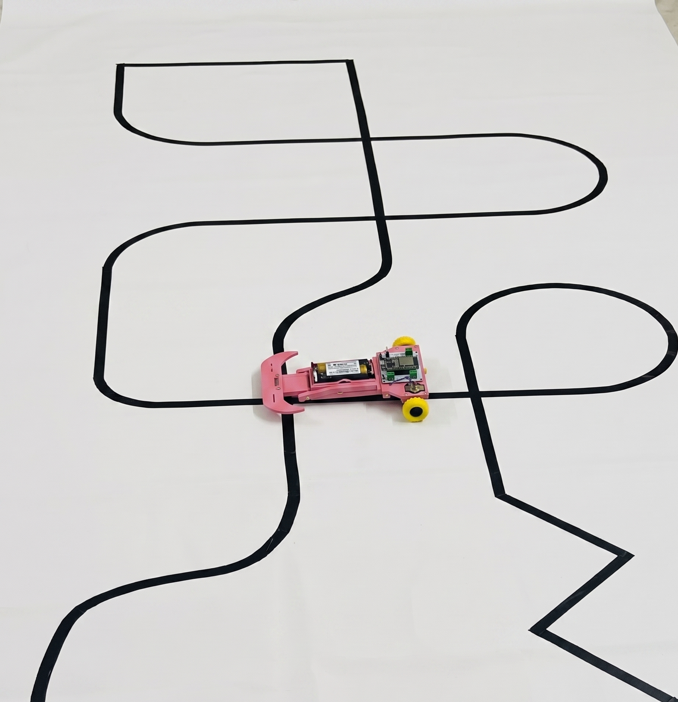
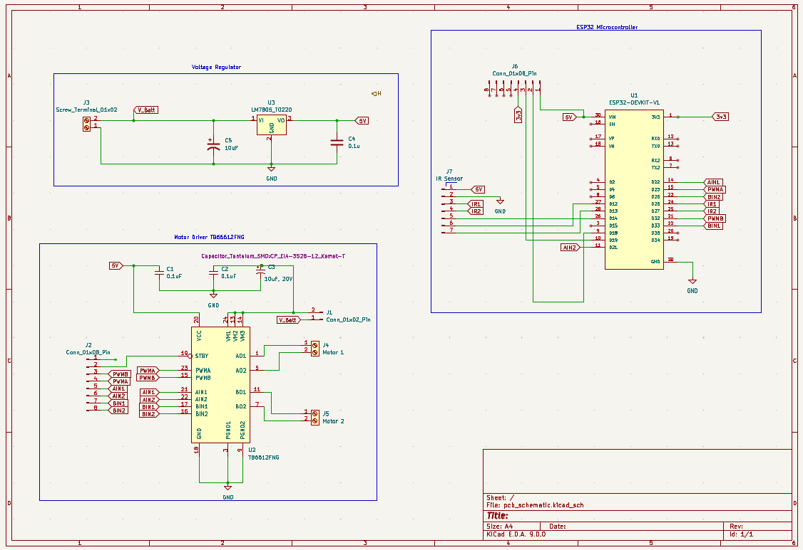
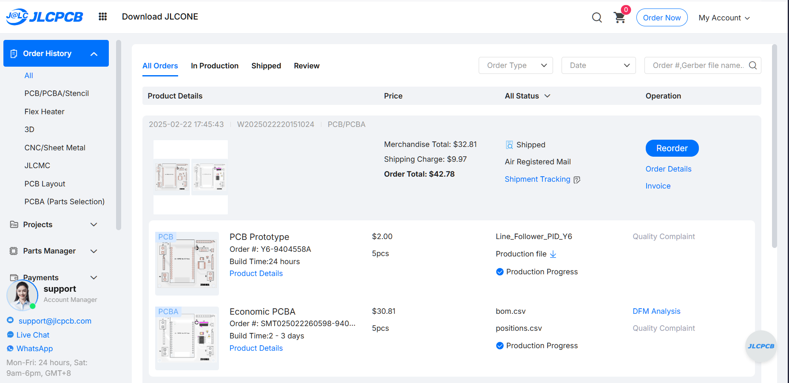
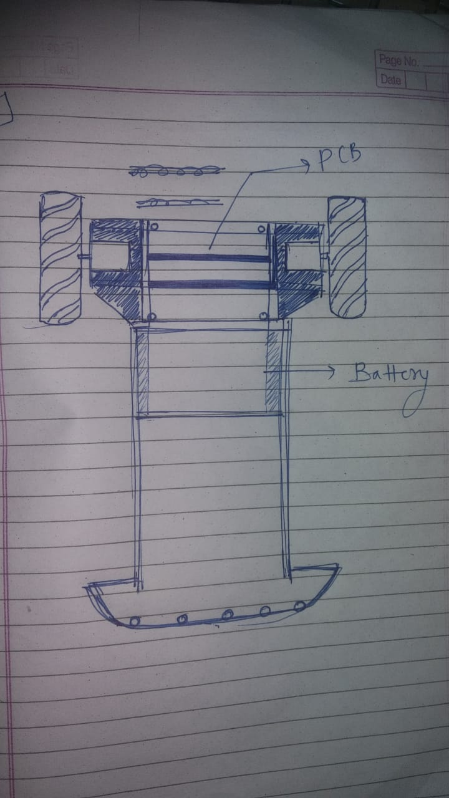
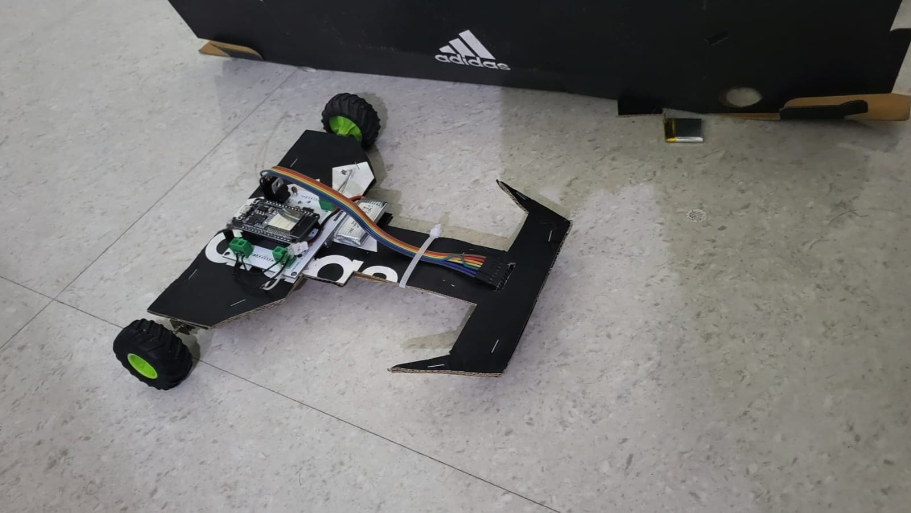
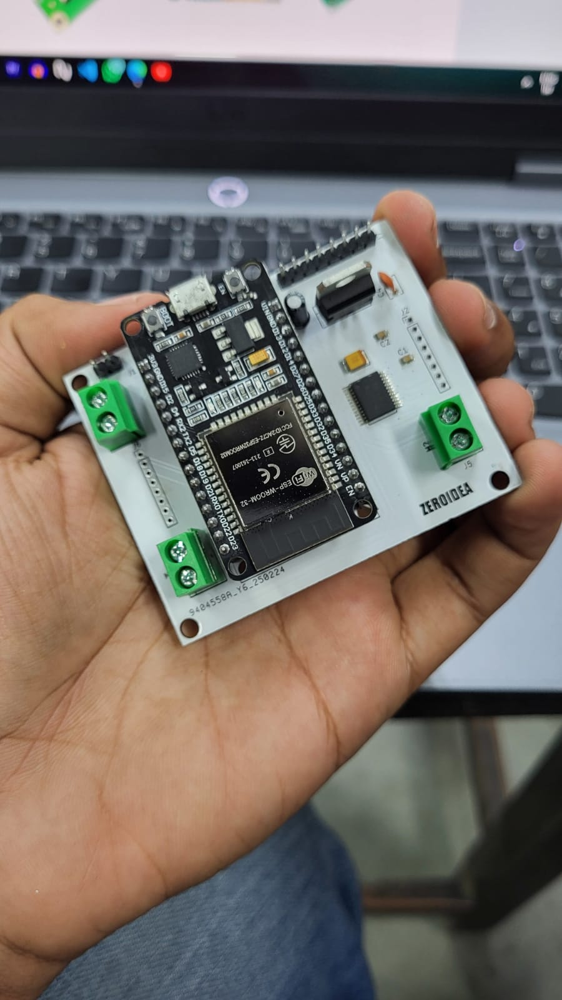
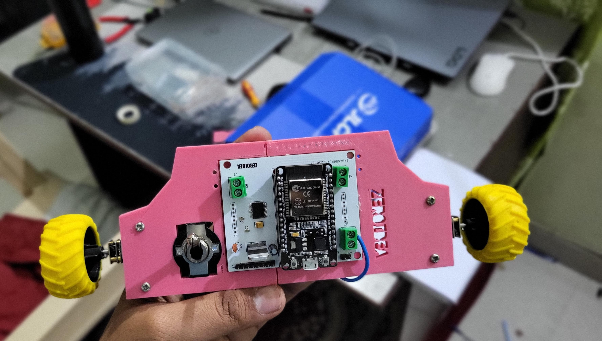
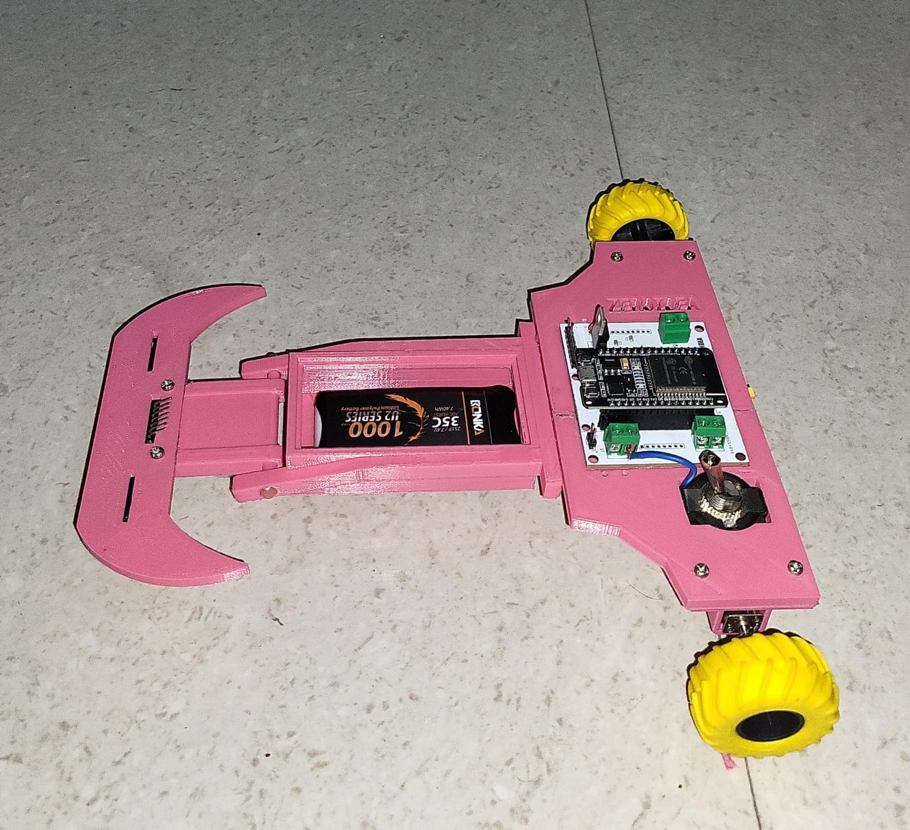

# ZeroIdea — Custom PID Line Follower Robot

**A fully self-designed autonomous line-following robot** — custom CAD chassis, custom PCB, and PID-tuned firmware, built from a blank page to a competition-ready bot for **Trailblaze**, the autonomous line-follower event at **Cognizance** (IIT Roorkee's techfest).

This was my first robotics project end-to-end. Nothing here is a pre-built kit — the chassis was modeled from scratch, the PCB was designed and fabricated at JLCPCB, and the control loop was tuned by hand until the robot could hold a line through tight S-curves at roughly **2 m/s**.



---

## Table of Contents

- [Why this project is different](#why-this-project-is-different)
- [Tech stack](#tech-stack)
- [System architecture](#system-architecture)
- [Hardware](#hardware)
  - [Electronics / Custom PCB](#electronics--custom-pcb)
  - [Why TB6612FNG over L298N](#why-tb6612fng-over-l298n)
  - [Mechanical / CAD Chassis](#mechanical--cad-chassis)
- [Firmware & Control Loop](#firmware--control-loop)
  - [PID Line Following](#pid-line-following)
  - [Bluetooth Live Tuning](#bluetooth-live-tuning)
  - [Lost-Line Recovery](#lost-line-recovery)
- [Build Log — From Sketch to Finish](#build-log--from-sketch-to-finish)
- [Performance](#performance)
- [Repository Structure](#repository-structure)
- [How to Replicate This Project](#how-to-replicate-this-project)
- [Reference Material](#reference-material)
- [Future Improvements](#future-improvements)
- [Credits](#credits)

---

## Why this project is different

Most hobby line followers are built around an off-the-shelf robot chassis kit (two-wheel acrylic base + generic sensor board) with an Arduino dropped on top. **ZeroIdea was built the other way around**: every physical and electrical constraint was decided first, then the parts were designed to fit them.

- **Custom CAD chassis** — modeled from a hand-drawn concept sketch, iterated through a cardboard proof-of-concept, and finalized as a 3D-printed body with a cantilevered sensor arm, a swappable battery bay, and dedicated motor mounts. Every STL in this repo was drawn for this robot; none are downloaded kit parts.
- **Custom PCB, not a protoboard** — the ESP32, motor driver, regulator, and sensor header all live on a single fabricated board (`ZEROIDEA`), professionally manufactured through JLCPCB rather than hand-wired on perfboard.
- **Deliberate driver choice, backed by research** — the motor driver isn't the "default" L298N most beginner tutorials use. TB6612FNG was chosen after a direct technical comparison (see [below](#why-tb6612fng-over-l298n)) for better efficiency, lower voltage drop, and hardware braking.
- **Field-tuned PID with live Bluetooth control** — Kp/Ki/Kd can be adjusted from a phone in real time without re-flashing the firmware, which is how the final gains were actually found on the test track.
- **Competition-grade result** — holds the line through sharp zig-zags and consecutive S-curves (see test track photo above) at approximately **2 m/s**, a strong result for a 5-sensor analog array on a robot this size.

---

## Tech stack

| Layer | Choice |
|---|---|
| Microcontroller | ESP32-DevKit-V1 (ESP-WROOM-32) |
| Motor Driver | TB6612FNG dual H-bridge |
| Voltage Regulation | LM7805 linear regulator |
| Line Sensing | 5-channel analog IR reflectance array (QTR-style) |
| Power | 2S Li-Po, 7.4 V, 1000 mAh, 35C |
| Control Link | Classic Bluetooth Serial (SPP), onboard ESP32 radio |
| Firmware | Arduino core for ESP32, `QTRSensors` + custom `TB6612FNG` motor library |
| PCB Design | KiCad (schematic + layout), fabricated via JLCPCB |
| Mechanical Design | Parametric CAD → STL, FDM 3D-printed chassis |
| Tuning Interface | Bluetooth Serial byte-protocol (custom, phone-controllable) |

---

## System architecture

```
                 ┌──────────────────────────┐
   7.4V 2S LiPo ─┤        ZEROIDEA PCB       │
                 │                           │
        ┌────────┤  LM7805  →  5V rail       │
        │        │                           │
        │        │  ESP32-WROOM-32           │
 IR x5 ─┼───────►│   • Reads sensor array    │
        │        │   • Runs PID loop         │
        │        │   • Bluetooth Serial link │
        │        │        │                  │
        │        │        ▼                  │
        │        │   TB6612FNG H-Bridge       │
        │        │    │            │          │
        │        └────┼────────────┼──────────┘
        │             ▼            ▼
        │         Left Motor   Right Motor
        │
   Battery also feeds TB6612FNG directly (V_Batt), independent of the 5V logic rail
```

The ESP32 reads the 5-sensor array every loop, computes a PID correction, and differentially drives the two motors through the TB6612FNG. A phone connected over Bluetooth Serial can push new Kp/Ki/Kd values or toggle run/stop at any time — this is how the final gains were tuned on-track without a laptop tether.

---

## Hardware

### Electronics / Custom PCB

The full circuit lives on a single custom PCB (silkscreened `ZEROIDEA`), designed in KiCad and fabricated through JLCPCB.



The schematic is organized into four functional blocks:

1. **Voltage Regulator** — an LM7805 (TO-220) steps the raw 7.4 V battery rail down to a stable 5 V logic supply, with tantalum input/output capacitors for ripple suppression.
2. **ESP32 Microcontroller** — an ESP32-DevKit-V1 module handles sensor reads, PID computation, and the Bluetooth Serial link. Its GPIOs break out directly to the IR sensor header and the motor driver's control pins.
3. **Motor Driver (TB6612FNG)** — takes direction (AIN1/AIN2, BIN1/BIN2) and PWM (PWMA/PWMB) signals from the ESP32 and drives both motors directly off the battery rail (`V_Batt`), independent of the 5 V logic supply.
4. **IR Sensor Header** — a single 7-pin connector (5 V, GND, IR1, IR2, and the remaining sensor lines) feeding the 5-channel analog array on the front sensor arm.

Board fabrication was ordered as 5 pieces + basic assembly through JLCPCB:



| Order | Qty | Cost |
|---|---|---|
| PCB Prototype (bare board) | 5 pcs | $2.00 |
| PCBA (assembled) | 5 pcs | $30.81 |
| Shipping (Air Registered Mail) | — | $9.97 |
| **Total** | | **$42.78** |

Gerber files, drill files, and the KiCad schematic source are provided in [`hardware/`](hardware/) for anyone who wants to fabricate the same board.

### Why TB6612FNG over L298N

The L298N is the default motor driver in almost every beginner line-follower tutorial, so it was worth actually checking whether it was the right choice here before committing PCB real estate to it. A short comparison was written up before finalizing the schematic (full write-up in [`docs/motor_driver_research.pdf`](docs/motor_driver_research.pdf)); the key numbers:

| Parameter | L298N | TB6612FNG |
|---|---|---|
| Switching element | BJT (H-bridge) | MOSFET |
| Voltage drop across driver | ~1.4 V | ~0.5 Ω on-resistance (much lower loss) |
| Max motor voltage | 46 V | 13.5 V |
| Logic voltage range | 4.5 – 7 V | 2.7 – 5.5 V |
| Standby current | N/A | ~0.1 µA (via STBY pin) |
| Thermal shutdown | Not implemented | Hardware-automated |
| Brake mode | Software-simulated | Hardware short-brake |

For a small, battery-powered, low-voltage robot, the L298N's ~1.4 V BJT drop is a meaningful chunk of a 7.4 V supply — it's simply built for higher-voltage, higher-current loads than a line follower needs. The TB6612FNG's MOSFET stage wastes far less power at these voltages, supports a true hardware brake (useful for the sharp direction reversals a PID line follower does constantly), and exposes a standby pin for clean shutdown. The one tradeoff: unlike most L298N Arduino libraries, the TB6612FNG **requires explicit STBY pin management** — it will not drive the motors unless STBY is held HIGH — which is handled in `setup()` in the firmware.

### Mechanical / CAD Chassis

The chassis went through four distinct stages before reaching its final form — all CAD files are in [`cad/`](cad/).

- **Concept sketch** — a "racing car" layout: both motors at the rear, a caster ball up front for a third support point, and the sensor array extended forward of the caster ball so the line is detected before the robot's pivot point reaches it.
- **Cardboard prototype** — the layout was validated physically before committing to 3D printing, confirming component placement, wiring routing, and the wheelbase.
- **3D-printed body (`main_body` → `main_body_final`)** — iterated to add a proper battery bay with a removable lid, a stronger caster-ball mount, and a cleaner cantilevered arm for the sensor array.
- **Final assembly** — the finished chassis holds the 2S Li-Po in an open-slide bay, the custom PCB mounted flat on top, and the 5-sensor IR array at the very front tip of the extended arm — maximizing the "look-ahead" distance so the PID loop has more time to react to upcoming curves.

Individual printed parts:

| Part | File | Purpose |
|---|---|---|
| Main body | `main_body_final.stl` | Central chassis, mounts PCB and battery bay |
| Left/Right motor mounts | `L_motor.stl`, `R_motor.stl` | Rear-wheel motor brackets |
| Sensor array holder | `sensor_array.stl`, `array_holder.stl` | Front cantilevered IR sensor mount |
| Caster ball holder | `casterball_holder.stl` | Third support point, front-center |
| Battery lid/cover | `batter_lid.stl`, `Battery_Cover.stl` | Removable battery bay cover |
| Base | `Base.stl` | Base structural component |

A CAD simulation of the original design is included at [`cad/first_cad_sim_of_original_design.mp4`](cad/first_cad_sim_of_original_design.mp4).

---

## Firmware & Control Loop

Full source: [`firmware/LineFollower/LineFollower.ino`](firmware/LineFollower/LineFollower.ino)

### PID Line Following

The sensor array reports a `position` value between 0–4000 (5 sensors × 1000 span), where 2000 is dead-center on the line. The error is simply:

```cpp
error = 2000 - position;
```

This error feeds a standard PID controller:

```cpp
P = error;
I = I + error;
D = error - previousError;

Pvalue = (Kp / pow(10, multiP)) * P;
Ivalue = (Ki / pow(10, multiI)) * I;
Dvalue = (Kd / pow(10, multiD)) * D;

PIDvalue = Pvalue + Ivalue + Dvalue;

lsp = lfspeed - PIDvalue;   // left motor speed
rsp = lfspeed + PIDvalue;   // right motor speed
```

- **Kp** (proportional) reacts to how far off-center the robot currently is. Too low and it cuts corners; too high and it oscillates violently on straights.
- **Ki** (integral) corrects small, persistent drift that Kp alone can't zero out — useful when the sensor array or motors aren't perfectly symmetric.
- **Kd** (derivative) reacts to *how fast* the error is changing, which is what lets the robot brake into a sharp curve instead of overshooting it.

Each gain has an associated `multiP` / `multiI` / `multiD` exponent, because the three terms operate at wildly different scales (Kd needs to be a fraction of Kp, Ki needs to be a small fraction of that) — dividing by `10^multi` lets all three be sent over Bluetooth as plain bytes (0–255) while still reaching the tiny decimal values PID tuning actually needs.

### Bluetooth Live Tuning

Instead of re-flashing firmware every time a gain needed adjusting, the ESP32 listens for 2-byte command packets over Bluetooth Serial:

```cpp
switch (a) {   // a = v[1] = command ID, v[2] = value
    case 1: Kp = v[2]; break;
    case 2: multiP = v[2]; break;
    case 3: Ki = v[2]; break;
    case 4: multiI = v[2]; break;
    case 5: Kd = v[2]; break;
    case 6: multiD = v[2]; break;
    case 7: onoff = v[2]; break;   // remote start/stop
}
```

A simple phone app (sliders bound to command IDs 1–7) makes it possible to nudge Kp up half a point, watch the very next lap, and adjust again — which is how PID tuning is actually done in practice; guessing gains blind and re-flashing after every change would have made this project take far longer.

### Lost-Line Recovery

If all 5 sensors read high simultaneously (either a full intersection, a very sharp turn that's swept the whole array off the line, or the end of the track), pure PID has nothing to correct against. The firmware falls back to spinning in place, using the *sign* of the last known error to guess which way the line went:

```cpp
if (all 5 sensors saturated) {
    if (previousError > 0) motor_drive(-230, 230);   // spin one way
    else                   motor_drive(230, -230);   // spin the other way
}
```

This is a simple but effective way to recover from a momentary total loss of the line without needing a lookup table of the whole track.

---

## Build Log — From Sketch to Finish

A full pictorial build log, with every prototype stage and the fabrication process, is included as a single document: **[`docs/ZeroIdea_Build_Log.pdf`](docs/ZeroIdea_Build_Log.pdf)**.

Highlights from that build:

<table>
  <tr>
    <td width="150" align="center"><br><sub><b>1. Concept sketch</b></sub></td>
    <td>Layout planning on paper, before any CAD — motor, PCB, and battery placement decided here.</td>
  </tr>
  <tr>
    <td width="150" align="center"><br><sub><b>2. Cardboard prototype</b></sub></td>
    <td>Validating placement and wiring before committing to 3D printing.</td>
  </tr>
  <tr>
    <td width="150" align="center"><br><sub><b>3. PCB delivered</b></sub></td>
    <td>The fabricated <code>ZEROIDEA</code> board, back from JLCPCB.</td>
  </tr>
  <tr>
    <td width="150" align="center"><br><sub><b>4. Chassis + PCB assembled</b></sub></td>
    <td>3D-printed body with the board mounted in place.</td>
  </tr>
  <tr>
    <td width="150" align="center"><br><sub><b>5. Final assembly</b></sub></td>
    <td>Battery bay, sensor arm, and full wiring complete.</td>
  </tr>
  <tr>
    <td width="150" align="center"><br><sub><b>6. On the test track</b></sub></td>
    <td>Running the serpentine test course at full speed.</td>
  </tr>
</table>

*(Thumbnails are fixed to a small square so the table stays compact — open [`docs/ZeroIdea_Build_Log.pdf`](docs/ZeroIdea_Build_Log.pdf) for the full, uncropped photos.)*

---

## Performance

- Holds the line reliably through tight S-curves, consecutive zig-zags, and loop sections on a hand-built serpentine test track.
- Sustains approximately **2 m/s** in a straight line while remaining recoverable through curves — a strong result for a 5-point analog sensor array (versus 8+ sensor arrays commonly used at similar speeds).
- Recovers from full-line-loss (intersections/track ends) via the spin-recovery fallback rather than stalling.
- Built and tuned specifically to meet Trailblaze's arena spec: 2 cm black line on white, sharp turns, curves, and intersections.

---

## Repository Structure

```
ZeroIdea-LineFollower/
├── README.md
├── LICENSE
│
├── firmware/
│   └── LineFollower/
│       └── LineFollower.ino          # ESP32 PID + Bluetooth-tuning firmware
│
├── hardware/
│   ├── schematic/
│   │   ├── pcb_schematic.kicad_sch   # KiCad source schematic
│   │   └── pcb_schematic.png         # Exported schematic image
│   ├── gerbers/
│   │   └── Line_Follower_Gerber.zip  # Full fab-ready Gerber/drill set
│   └── jlcpcb_quotation.png          # Fabrication order + cost breakdown
│
├── cad/
│   ├── ZeroIdea_CAD_Models.zip       # All STL/3MF chassis parts
│   └── first_cad_sim_of_original_design.mp4
│
├── docs/
│   ├── ZeroIdea_Build_Log.pdf        # Full pictorial build log
│   ├── motor_driver_research.pdf     # TB6612FNG vs L298N comparison
│   └── competition_brief.pdf         # Trailblaze (Cognizance) rules/spec
│
└── assets/
    └── img/                         # Individual build-stage photos (referenced above)
```

---

## How to Replicate This Project

1. **Fabricate the PCB.** Upload the Gerber files from [`hardware/gerbers/`](hardware/gerbers/) to JLCPCB (or any fab house) as-is. Optionally use JLCPCB's assembly service with the same order to get the board pre-populated.
2. **3D-print the chassis.** Print every STL in [`cad/`](cad/). All parts were printed FDM; no supports needed beyond what your slicer suggests by default for overhangs on the sensor arm.
3. **Assemble the electronics.** Solder/seat the ESP32-DevKit-V1 onto the PCB, wire the two DC gear motors to the TB6612FNG motor terminals, connect the 5-channel IR array to the sensor header, and connect a 2S Li-Po (7.4 V) to the battery input.
4. **Flash the firmware.** Open [`firmware/LineFollower/LineFollower.ino`](firmware/LineFollower/LineFollower.ino) in Arduino IDE with the ESP32 board package installed, install the `QTRSensors` library, and flash it over USB.
5. **Calibrate.** Power on over a section of track — the firmware runs a 400-cycle sensor calibration sweep on boot (LED lit during calibration). Make sure the array crosses the black line during this window.
6. **Tune PID over Bluetooth.** Pair with the robot (`LFR_Robot`) from a phone and send the 2-byte command packets described in [Bluetooth Live Tuning](#bluetooth-live-tuning) to dial in Kp/Ki/Kd live on the track, starting with Kp only, then adding Kd, then a small Ki if needed.
7. **Race it.**

---

## Reference Material

This project didn't start from zero — these were the primary references used during research and design:

- [Line Follower Robot with PID Controller — Bot Reboot (Hackster.io)](https://www.hackster.io/anova9347/line-follower-robot-with-pid-controller-cdedbd) — the main reference for the PID structure and the Bluetooth byte-protocol used for live gain tuning; the firmware in this repo adapts that architecture from an Arduino Pro Mini + DRV8835 platform to ESP32 + TB6612FNG.
- Motor driver comparison research — see [`docs/motor_driver_research.pdf`](docs/motor_driver_research.pdf) for the full TB6612FNG vs. L298N technical write-up.
- Supplementary video references used for build technique and PID tuning intuition (see original project notes for links).

---

## Future Improvements

- Move to a digital/8+ channel sensor array for finer position resolution at higher speeds.
- Add an IMU (gyro) for sensor-fusion-assisted cornering on very sharp turns.
- Closed-loop speed control (encoders) instead of open-loop PWM to the motors, for more consistent speed across battery discharge.
- Replace the phone-based Bluetooth tuner with a small on-board OLED + rotary encoder for tuning without a paired device.

---

## Credits

Designed, built, and tuned as an independent project — CAD, PCB, and firmware all original work for this robot, built for the Trailblaze event at Cognizance (IIT Roorkee).
